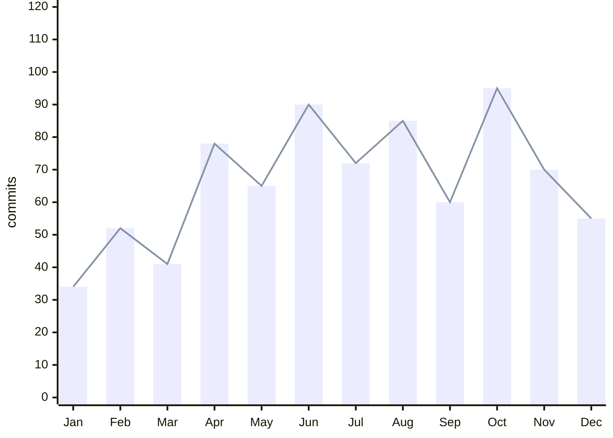
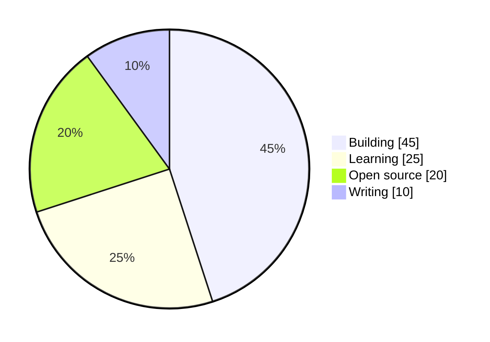

<!-- Replace: YOUR_USERNAME, Your Name, links, and the chart data below -->

<h1 align="center">Azib Mehraj</h1>

<p align="center">
  
</p>

<p align="center">
  <a href="https://your-site.com">website</a> &nbsp;·&nbsp;
  <a href="https://linkedin.com/in/azib-mehraj">linkedin</a> &nbsp;·&nbsp;
  <a href="https://x.com/YOUR_USERNAME">x</a> &nbsp;·&nbsp;
  <a href="mailto:azibmehraj7.pers.com">email</a>
</p>

<br/>

```yaml
location : Your City, Country
role     : Full-Stack Developer
focus    : web apps, developer tooling, open source
learning : Rust, system design
open to  : collaborations & interesting problems
```

<br/>

### stack

`TypeScript` · `Python` · `Go` · `React` · `Next.js` · `Node.js` · `PostgreSQL` · `Redis` · `Docker` · `AWS`

<br/>

### activity

<picture>
  <source media="(prefers-color-scheme: dark)" srcset="https://github-readme-activity-graph.vercel.app/graph?username=YOUR_USERNAME&bg_color=0d1117&color=8b949e&line=c9d1d9&point=ffffff&area=true&area_color=30363d&hide_border=true&hide_title=true&height=250">
  <source media="(prefers-color-scheme: light)" srcset="https://github-readme-activity-graph.vercel.app/graph?username=YOUR_USERNAME&bg_color=ffffff&color=57606a&line=24292f&point=24292f&area=true&area_color=d0d7de&hide_border=true&hide_title=true&height=250">
  
</picture>

<br/>

### numbers

<table>
<tr>
<td width="50%" valign="top">

<picture>
  <source media="(prefers-color-scheme: dark)" srcset="https://github-readme-stats.vercel.app/api?username=YOUR_USERNAME&show_icons=true&hide_border=true&bg_color=00000000&title_color=c9d1d9&text_color=8b949e&icon_color=8b949e&hide_title=true&hide_rank=false&include_all_commits=true&line_height=26">
  <source media="(prefers-color-scheme: light)" srcset="https://github-readme-stats.vercel.app/api?username=YOUR_USERNAME&show_icons=true&hide_border=true&bg_color=00000000&title_color=24292f&text_color=57606a&icon_color=57606a&hide_title=true&hide_rank=false&include_all_commits=true&line_height=26">
  
</picture>

</td>
<td width="50%" valign="top">

<picture>
  <source media="(prefers-color-scheme: dark)" srcset="https://github-readme-stats.vercel.app/api/top-langs/?username=YOUR_USERNAME&layout=donut-vertical&hide_border=true&bg_color=00000000&title_color=c9d1d9&text_color=8b949e&langs_count=6&hide_title=true">
  <source media="(prefers-color-scheme: light)" srcset="https://github-readme-stats.vercel.app/api/top-langs/?username=YOUR_USERNAME&layout=donut-vertical&hide_border=true&bg_color=00000000&title_color=24292f&text_color=57606a&langs_count=6&hide_title=true">
  
</picture>

</td>
</tr>
</table>

<picture>
  <source media="(prefers-color-scheme: dark)" srcset="https://github-readme-streak-stats.herokuapp.com/?user=YOUR_USERNAME&hide_border=true&background=00000000&stroke=30363d&ring=8b949e&fire=c9d1d9&currStreakNum=c9d1d9&sideNums=c9d1d9&currStreakLabel=8b949e&sideLabels=8b949e&dates=6e7681">
  <source media="(prefers-color-scheme: light)" srcset="https://github-readme-streak-stats.herokuapp.com/?user=YOUR_USERNAME&hide_border=true&background=00000000&stroke=d0d7de&ring=57606a&fire=24292f&currStreakNum=24292f&sideNums=24292f&currStreakLabel=57606a&sideLabels=57606a&dates=6e7681">
  
</picture>

<br/>

### this year in commits

> Native GitHub chart. Edit the numbers below to match your own activity.



<br/>

### where my time goes



<br/>

### selected work

| project | what it does | stack |
|:--|:--|:--|
| [**project-one**](https://github.com/YOUR_USERNAME/project-one) | One clear sentence about it | `TypeScript` `React` |
| [**project-two**](https://github.com/YOUR_USERNAME/project-two) | One clear sentence about it | `Python` `FastAPI` |
| [**project-three**](https://github.com/YOUR_USERNAME/project-three) | One clear sentence about it | `Go` `Docker` |

<br/>

<p align="center">
  <sub>last updated with care · open to new ideas</sub>
</p>
